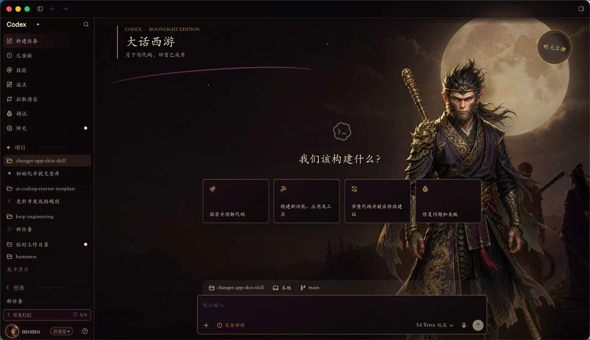

# Codex Desktop Skinning

<<<<<<< Updated upstream
可复用的 Codex/ChatGPT Desktop **动态皮肤** Skill。它覆盖官方主题 token 分析、CDP 注入、背景与透明前景分层、页面状态切换、macOS/Windows 桌面入口、双平台安装包，以及真实 WebView 验证。

从 1.1 起，示例安装包内置 Dynamic Skin Studio：右下角直接点「皮肤」，即可在不退出 ChatGPT 的情况下切换大话西游静态原版、月灯浮游、极光流体和星轨夜航。选择会保留到下次 WebView 加载；动效也有「全开 / 省电」开关并遵循系统的减少动态效果偏好。
=======
为 Codex/ChatGPT Desktop 创建、验证和分发可逆的本地皮肤。项目覆盖主题 token 与实时 DOM 分析、CDP 注入、页面状态切换、macOS/Windows 启动器，以及双平台安装包校验。
>>>>>>> Stashed changes



## 能力

- 保留官方应用、账号数据、项目与任务，只在用户目录安装本地覆盖层。
- 分离场景背景、透明前景和原生控件，避免装饰元素拦截操作。
- 在新任务页、会话页和页面重载之间正确安装或清理皮肤。
- 生成 macOS `.app` 与 Windows 快捷方式，并提供对应的卸载入口。
- 校验发布 ZIP 的目录结构、双平台入口、核心资源和不应分发的文件。

## 安装 Skill

macOS 或 Linux：

```bash
git clone https://github.com/iunclear/chatgpt-app-skin-skill.git \
  "${CODEX_HOME:-$HOME/.codex}/skills/codex-desktop-skinning"
```

Windows PowerShell：

```powershell
git clone https://github.com/iunclear/chatgpt-app-skin-skill.git `
  "$HOME\.codex\skills\codex-desktop-skinning"
```

安装后，在 Codex 中调用：

```text
Use $codex-desktop-skinning to create and package a local Codex Desktop skin.
```

完整工作流与交付检查项见 [SKILL.md](SKILL.md)，平台启动器和发布包约束见 [platform-packaging.md](references/platform-packaging.md)。

## 示例包

<<<<<<< Updated upstream
`examples/dahua-xiyou/` 包含已校验的 `Codex-Dahua-Xiyou-Skin-1.1.0.zip` 及其 SHA-256 文件。解压后：macOS 双击 `Install-DahuaXiyou.command`，Windows 双击 `Install-DahuaXiyou.cmd`。安装后不用重启 ChatGPT 来切换皮肤。
=======
[`examples/dahua-xiyou/`](examples/dahua-xiyou/) 提供“大话西游”皮肤的效果图、双平台安装包和 SHA-256 校验文件：

| 文件 | 用途 |
| --- | --- |
| [`dahauxiyou.jpg`](examples/dahua-xiyou/dahauxiyou.jpg) | 皮肤效果预览 |
| [`Codex-Dahua-Xiyou-Skin-1.0.0.zip`](examples/dahua-xiyou/Codex-Dahua-Xiyou-Skin-1.0.0.zip) | macOS/Windows 安装包 |
| [`Codex-Dahua-Xiyou-Skin-1.0.0.zip.sha256`](examples/dahua-xiyou/Codex-Dahua-Xiyou-Skin-1.0.0.zip.sha256) | 安装包完整性校验值 |

解压安装包后：

- macOS：完全退出 Codex/ChatGPT Desktop，再双击 `Install-DahuaXiyou.command`。
- Windows：完全退出 Codex/ChatGPT Desktop，再双击 `Install-DahuaXiyou.cmd`。
- 卸载：运行同平台的 `Uninstall-DahuaXiyou.command` 或 `Uninstall-DahuaXiyou.cmd`。

## 校验发布包

校验器适用于遵循发布结构的任意皮肤包，不依赖示例皮肤的名称：

```bash
./scripts/validate-skin-package.sh path/to/Codex-My-Skin-1.0.0.zip
```

示例包可直接验证：

```bash
./scripts/validate-skin-package.sh \
  examples/dahua-xiyou/Codex-Dahua-Xiyou-Skin-1.0.0.zip
```

## 项目结构

```text
.
├── SKILL.md                         Skill 工作流与完成标准
├── agents/openai.yaml               Codex Skill 展示配置
├── examples/dahua-xiyou/            示例截图、安装包与校验值
├── references/platform-packaging.md 跨平台打包规范
└── scripts/validate-skin-package.sh  发布包校验器
```

## 安全边界

皮肤应始终作为用户目录中的可移除覆盖层运行，不修改 `app.asar`、官方应用包、完整性检查或真实账号数据。桌面应用升级后 DOM 结构可能变化，发布前应按照 [SKILL.md](SKILL.md) 的检查清单重新完成真实 WebView 验证。
>>>>>>> Stashed changes
